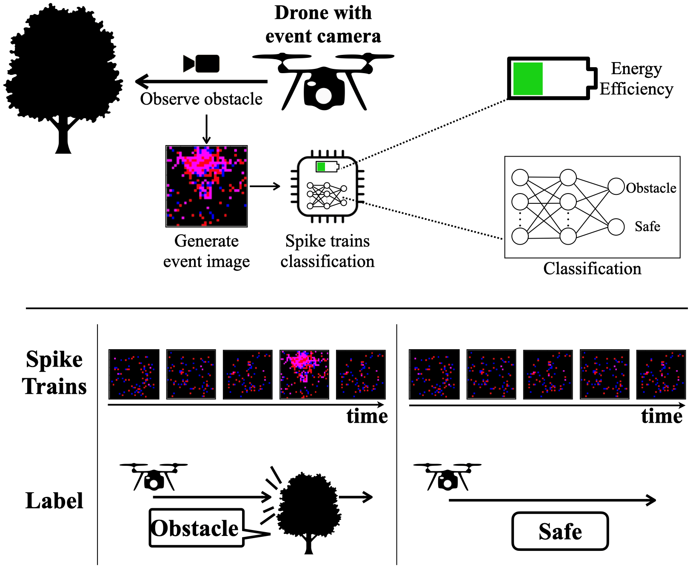
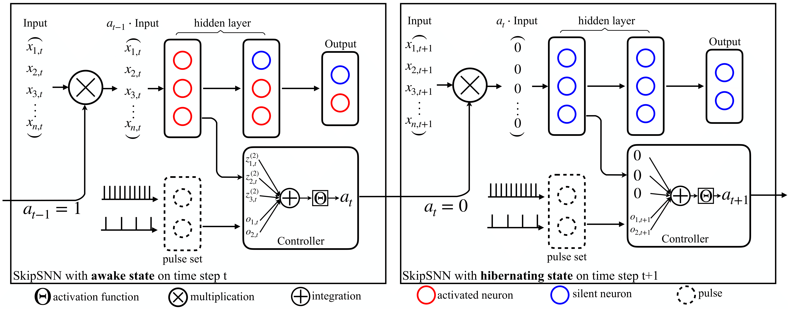

# SkipSNN Efficiently Classifying Spike Trains with Event-attention

Anonymous repository for SkipSNN: Efficiently Classifying Spike Trains with Event-attention.
This repository contains the implementation of SkipSNN.

### The problem of efficient classification of spike trains.


The problem definition of efficient classification of spike trains. The spike trains are generated by an event camera, which is an imaging sensor that responds to local changes in brightness. Each pixel inside an event camera operates independently and asynchronously, reporting changes in brightness as they occur, and staying silent otherwise. Therefore, each image can be considered as binary event image.

### Network Architecture


## File listing

The corresponding files contain the source code and sample data of JERS.

+ __main_nmnist_noise.py__ : Main code for SkipSNN training
+ __model_nmnist_noise.py__ : Supporting models of SkipSNN
+ __modules.py__ : Base model for the SkipNet
+ __NmnistLoader.py__ : Supporting dataloader of N-mnist dataset
+ __noise_base.py__ : Base model for adding noise to the dataset
+ __spikeFileIO.py__ : Supporting functions for SkipSNN training

Note that all public datasets used in the paper can be found here:
+ __[N-MNIST](https://www.garrickorchard.com/datasets/n-mnist)__ 
+ __[DVS-Gesture](https://ibm.ent.box.com/s/3hiq58ww1pbbjrinh367ykfdf60xsfm8)__ 

Raw data can be preprocessed via noise_base.py and NmnistLoader.py.

## Instructions on training SkipSNN

The following script is for training:

```
python main_nmnist_noise.py
```
<b>Parameters:</b>

+ __run()__ :
	+ __N_CLASSES__ : number of classes for classification
	+ __LEARNING_RATE__ : learning rate for training
	+ __N_EPOCHS__ : number of epochs for training
	+ __SEQ_LENGTH__ : setting of squence length
	+ __BASE__ :  if load base model
	+ __PATH__ :  path of the base model
	+ __LENS__ :  parameter for temperature decay
    + __LAMBDA__ : parameter for spike training
	+ __LOC__ : start index of the controller


## Result
The results can be find after training.
+ __pred__ : predictions
+ __truth tag__ : ground truth values 
+ __truth loc__ : start index of the controller
+ __state updates__ : state updates of the model
+ __time cost__ : inference time